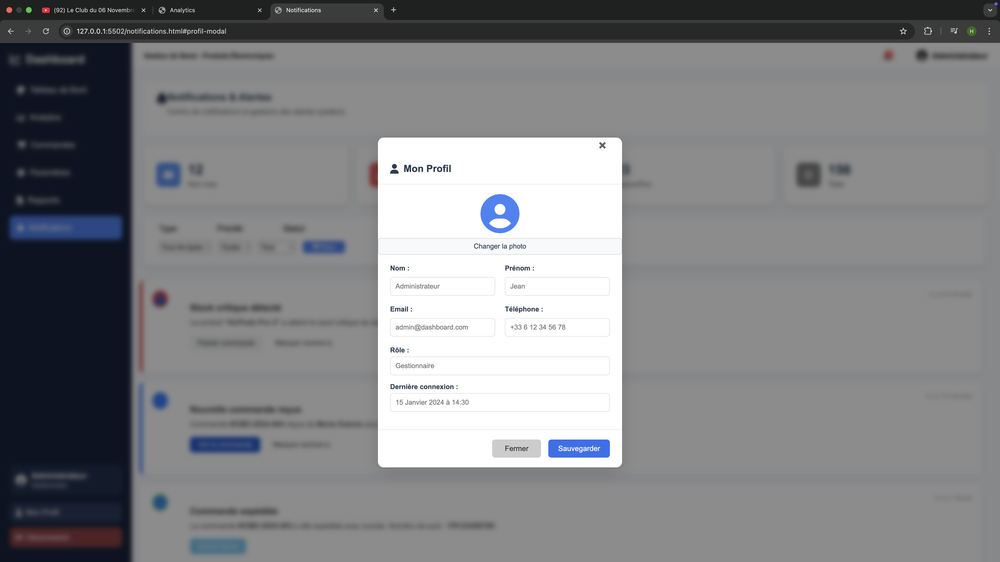
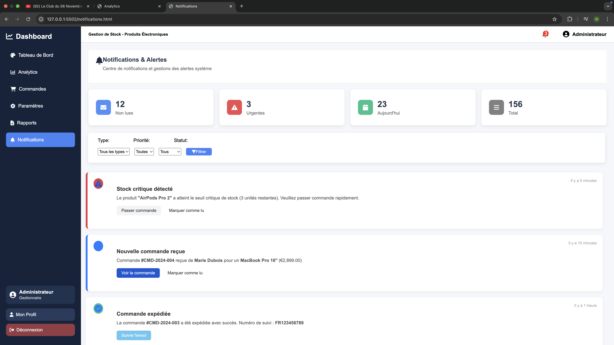
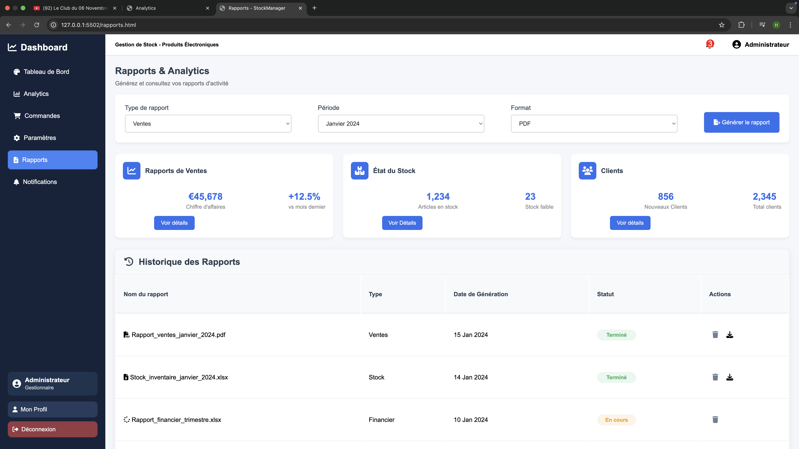
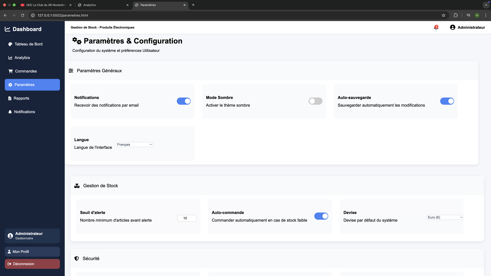
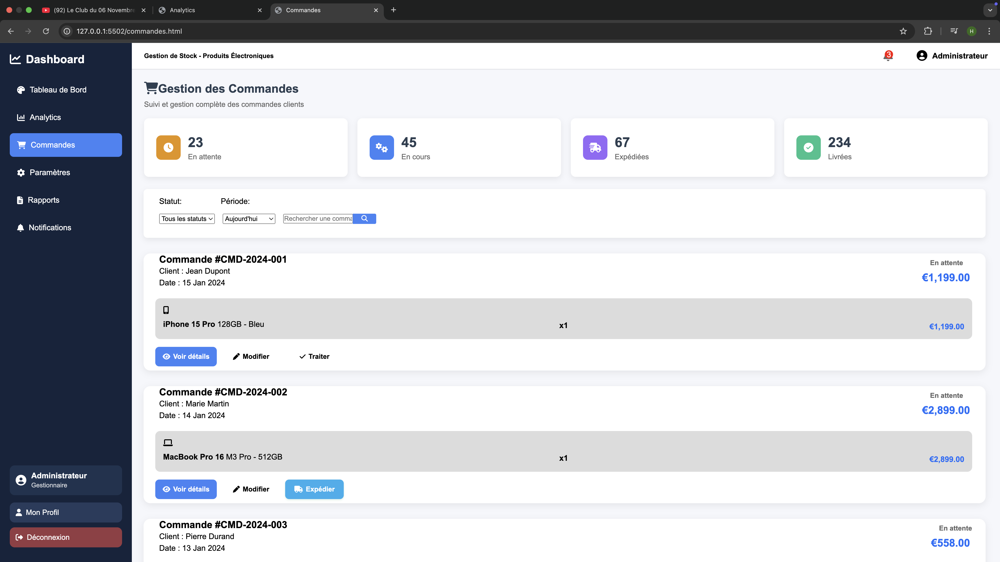
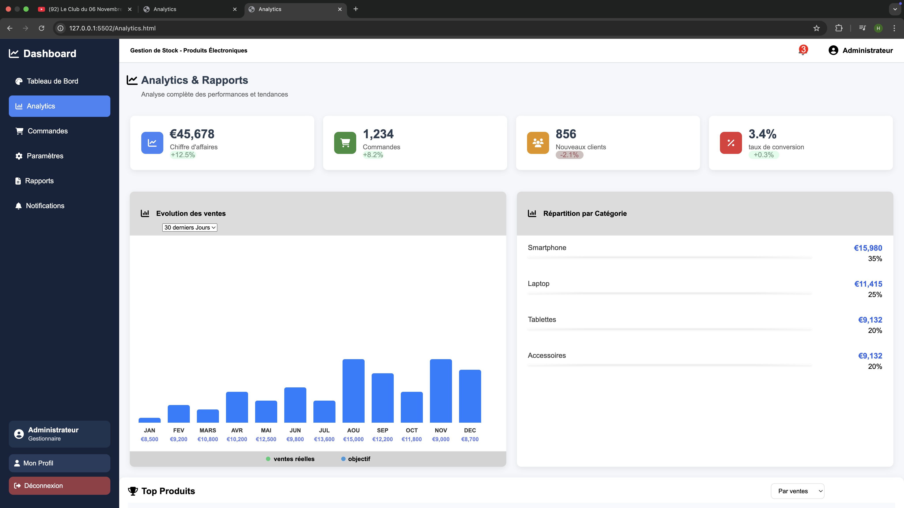
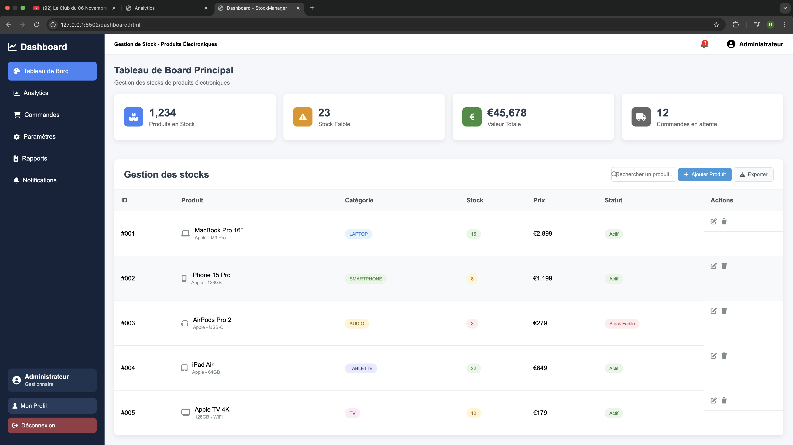

# StockManager Dashboard

Une interface web moderne et responsive pour la **gestion de stock** : suivi des produits, commandes, rapports et profils utilisateurs.  
Ce projet est entièrement réalisé en **HTML, CSS et Font Awesome**, sans JavaScript.

---

##  Fonctionnalités principales

###  Authentification
- Page **Connexion** (Login) avec champ de mot de passe, option *Se souvenir de moi*.
- Page **Inscription** avec formulaire complet (Nom, Prénom, Email, Mot de passe).
- Redirection vers le tableau de bord après connexion.

### Tableau de bord
- Vue d’ensemble des commandes, produits et rapports.
- Design moderne et adaptatif pour toutes les tailles d’écran.

###  Modals (Fenêtres modales)
- **Détails d’une commande** : affichage du numéro, statut, client, articles, total.
- **Modification de commande** : formulaire de mise à jour du statut, adresse et notes internes.
- **Profil utilisateur** : affichage et modification du nom, email, téléphone, rôle, dernière connexion.

###  Tableau des rapports
- Liste des rapports générés (Ventes, Stock, Financier).
- Responsive design :
  - Vue en colonnes sur mobile.
  - Alignement clair et espacé sur desktop.
- Icônes interactives pour **télécharger** ou **supprimer** un rapport.

### Notifications
- Icône de cloche avec badge rouge animé.
- Animation basée sur `scale()` (effet de pulsation) pour indiquer une nouvelle notification.

---

## Structure du projet
le contenu est structurer avec  des balises HTML sémantiques. bien adaptée pour ce projet

## Responsive Design

- Le design s’adapte automatiquement aux résolutions tablettes.  
- Réduction des tailles de police et marges sur les tablettes.  
- Réajustement des espacements internes pour tous les blocs.  
- Alignement optimisé pour une expérience fluide sur tous les appareils.  
- Les images et illustrations se redimensionnent automatiquement sans déformer la mise en page.
## Capture

